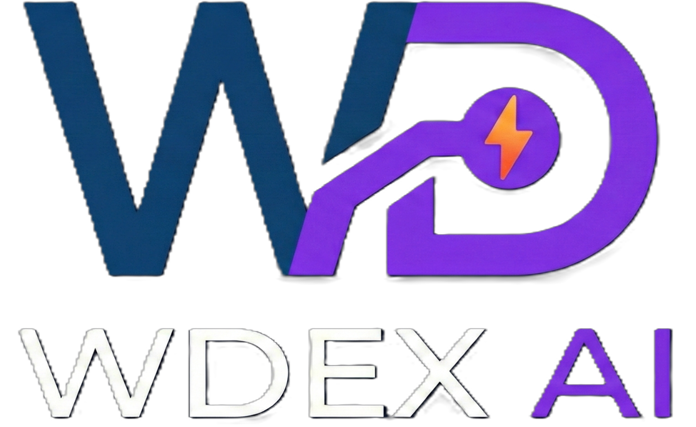

# WDex AI

<p align="center">
  
</p>

<p align="center">
  <strong>Asistente de batalla para Pokémon Showdown</strong><br/>
  Datos de tu equipo y del rival, debilidades tipo y sugerencias opcionales con IA.
</p>

<p align="center">
  
  
  
</p>

---

## ⚠️ Aviso importante — Uso responsable

**WDex AI es una herramienta de carácter experimental y educativa.** Está pensada para:

- **Aprender** tipos, ventajas y estrategia en batalla.
- **Jugar de forma casual** con amigos o en partidas no competitivas.
- **Explorar** el estado del combate y los datos del rival de forma clara.

**No está permitido ni recomendado usarla en partidas clasificatorias (Ladder)** de Pokémon Showdown. Hacerlo puede considerarse trampa y conllevar sanciones por parte de la plataforma. El desarrollador no se hace responsable del uso que se le dé a la extensión. Úsala de forma ética y bajo tu propia responsabilidad.

---

## Características

- **Modo solo datos (sin IA):** Muestra tu Pokémon activo, equipo, movimientos y la misma información del rival (sprite, tipos, movimientos vistos). Incluye **debilidades tipo** del rival (tipos a los que es débil).
- **Modo con IA (OpenRouter o Gemini):** Sugerencias de movimiento en español (“Atacar / Usar / Cambiar a” + “Por qué”) usando el estado de la batalla y los datos del rival.
- **Actualizar:** Vuelve a pedir sugerencia sin recargar la página (útil al cambiar de modelo).
- **Imágenes y tipos:** Sprites y tipos desde [PokeAPI](https://pokeapi.co/).

---

## Tecnologías

<p align="left">
  
  
  
  
  
  
  
  
  
</p>

- **Frontend:** React 18, Vite 5, Tailwind CSS, Framer Motion  
- **Extensión:** Chrome Manifest V3, Content Script + Injected Script  
- **APIs:** PokeAPI (sprites y tipos), OpenRouter y/o Google Gemini (sugerencias opcionales)  
- **Entorno:** Pokémon Showdown ([play.pokemonshowdown.com](https://play.pokemonshowdown.com))

---

## Instalación (Sideload — Modo desarrollador)

WDex AI **no está en la Chrome Web Store**. Se instala en modo desarrollador desde los archivos del repositorio. Así evitas restricciones de la tienda y tienes control total sobre la extensión.

### Requisitos

- [Node.js](https://nodejs.org/) (LTS recomendado) y npm  
- Navegador **Google Chrome** (o compatible con extensiones Manifest V3)

### Pasos

1. **Clonar o descargar el repositorio**
   ```bash
   git clone https://github.com/NyoWynn/WDex-AI.git
   cd WDex-AI
   ```

2. **Instalar dependencias y generar la extensión**
   ```bash
   npm install
   npm run build
   ```
   Se creará la carpeta `dist/` con los archivos de la extensión.

3. **Abrir Chrome en modo desarrollador**
   - Ve a `chrome://extensions`
   - Activa **“Modo desarrollador”** (arriba a la derecha)

4. **Cargar la extensión sin empaquetar**
   - Pulsa **“Cargar descomprimida”**
   - Selecciona la **carpeta del proyecto** (la que contiene `manifest.json` y la carpeta `dist/`), **no** solo `dist/`.
   - La extensión aparecerá en la barra de extensiones.

5. **Usar en Pokémon Showdown**
   - Entra a [play.pokemonshowdown.com](https://play.pokemonshowdown.com) y inicia o únete a una batalla.
   - Verás el overlay de WDex AI en la página. Arrástralo si lo necesitas.
   - En el engranaje puedes elegir **“Solo datos (sin IA)”** o configurar OpenRouter/Gemini con tu API key.

### Actualizar la extensión

Después de hacer `git pull` o descargar de nuevo el código:

```bash
npm install
npm run build
```

En `chrome://extensions`, pulsa el botón de **recargar** en la tarjeta de WDex AI. Si algo falla, recarga también la pestaña de Pokémon Showdown (F5).

---

## Configuración (modo con IA)

- **Solo datos (sin IA):** No requiere API key; solo muestra datos y debilidades del rival.
- **OpenRouter:** Crea una API key en [openrouter.ai/keys](https://openrouter.ai/keys) y elige un modelo (p. ej. DeepSeek R1, Mistral, modelos `:free`).
- **Gemini:** Usa una API key de [Google AI Studio](https://aistudio.google.com/) y selecciona “Gemini” en el overlay.

Las claves se guardan localmente en la extensión (Chrome storage) y no se envían a ningún servidor propio.

---

## Estructura del proyecto

```
WDex-AI/
├── manifest.json       # Manifest V3 de la extensión
├── logoWDEX.png        # Logo de la app
├── wynnDevLogo.png     # Logo del desarrollador (footer)
├── src/
│   ├── background.js   # Service worker: APIs (Gemini/OpenRouter), parseo de batalla
│   ├── content-script.jsx  # Inyecta React y comunica con background
│   ├── injected-script.js  # Log de batalla y datos del rival (MAIN world)
│   ├── index.css      # Estilos globales
│   └── components/
│       └── BattleOverlay.jsx  # UI: Pokémon, rival, debilidades, sugerencia
├── dist/               # Salida de `npm run build` (no se sube al repo)
├── package.json
└── README.md
```

---

## Licencia y autor

Proyecto de carácter **experimental y educativo**.  
Desarrollado por **Wynn** · [GitHub @NyoWynn](https://github.com/NyoWynn)

<p align="center">
  <a href="https://github.com/NyoWynn">
    
  </a>
</p>
